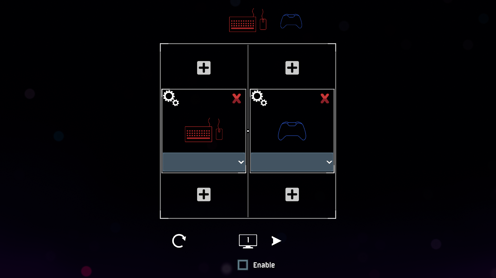

# Description

Splitscreen for Risk of Rain 2 with UI-based persistent preferences

# Instructions

1. Launch the game and click on 'Splitscreen' above 'Singleplayer' in the title menu

2. Assign players and customize

3. Click the toggle to enable the mod

4. Start a game normally

## Features

- Supports up to 4 players in singleplayer or multiplayer
- Seamless UI assignments with icon designs by Claymaver
- Persistent configuration
- Multiple monitor support
- Custom colors

## FAQ

1. Why won't the mod enable splitscreen?

   > If a player doesn't have a controller or a profile assigned or two players have the same profile assigned then splitscreen won't enable.

2. Why is there only 1 profile available to use?

   > Go back to the main menu and click on "Profile: " at the top right of the screen. Create a new profile and try again.

3. Why is the mod still refusing to enable splitscreen?

   > Hit the reset button and reassign everything.

4. Does the mod support multiple keyboards and mice?

   > No. This is a limitation in Risk of Rain 2 and therefore will never be supported by this mod. Use [Nucleus](https://nucleus-coop.github.io/) instead.

5. How do I bind my controls if they became unbound after starting a run?

   > 1. Press start or ESC to open the menu
   > 2. Open 'Settings'
   > 3. Rebind your controls one player at a time. The last player to provide input is the player the control will be bound to.

6. How do I disable multi-monitor mode?

   > Disabling activated displays in Unity is impossible. This means that to disable multi-monitor mode you must restart the game.

7. My issue isn't listed. What do I do?
   > [Join the Discord for support](https://discord.gg/maHhJSv62G)

## Known Issues

- Any user can change the loadout of the user who last refreshed the loadout panel
- Users can equip skills their profiles haven't unlocked
- Some buttons can still become unbound when entering a run
- When using the Command Cube / scrapping the camera may jump to another player
- Scoreboard UI may not work in multiplayer
- Using multiple monitors may cause UI issues
- Gamepad cursors don't work with scrollbars

## Special thanks

- iDeathHD for creating FixedSplitScreen
- [Claymaver](https://linktr.ee/claymaver) for art assets
- Narl for providing a temporary fix when it was broken by an update
- Donators keep mod development a priority in any busy lifestyle. Special thanks to:

NickmitdemKopf and BluJay, without whom patches beyond 3.0.0 likely wouldn't have come for quite a while!
LuizFilipeRN and technochips for Brazilian and French translations

- All the testers, supporters, and those who reported bugs including:

MemexJota,
PKPotential,
ThatBlueRacc,
Kaiben,
The*real_douchcanoe*,
KCaptainawesome,
O_Linny\_/O,
noahwubs,
Narl,
Hansei,
Aristhma,
Re-Class May,
AdaM,
Engi,
Coked Out Monkey,
Wumble,
God of Heck,
Pub,
Bloodgem64,
kwiki,
Wiism,
instasnipe,
Mo,
billredm,
TebZ,
TestMario,

- Extra special thanks to my son: the best splitscreen partner in the world
- Extra special thanks to my daughter: the best lemon artist in the world

## Changelog

**3.1.3**

- Fixed: Crashing with the new update. Thanks Narl! (multiplayer support not guaranteed)
- Added: Translations by LuizFilipeRN
- Remove ko-fi button
- Lemonized the Discord button

**3.1.2**

- Removed Patreon & Paypal buttons
- Added ko-fi button
- Custom language files can be used

**3.1.1**

- Disabled dev mode

**3.1.0**

This patch is dedicated to BluJay in honor of his generous donation as well! Thank you!

- Added: Slider for HUD scale
- Added: Paypal button
- Bug: Dragging sliders was not working for controllers
- Bug: Misc console error
- Bug: Lemonization issue

**3.0.1**

This patch is dedicated to NickmitdemKopf in honor of his generous donation. Thank you!

- Added: Error for insufficient number of profiles (this will delete existing language files)
- Added: The HUD can now be scaled per user by manually editing the '\_hudScale' value in the assignments.json file. GUI option is in development.
- Bug: UI scaling made the assignment window unusable for certain resolutions
- Bug: Wrong bindings displayed in runs

**3.0.0**

This update is a full and final rebuild of the entire mod. Many bugs have been fixed, while a few have been added. A lot of time went into this project resulting in what will hopefully be considered the closest Risk of Rain 2 can get to native splitscreen. Instead of listing every change, only the most notable will follow:

- Gamepad cursors work on most UI and on all monitors
- Preferences are properly associated with profiles
- Added localization support via language file

**2.0.8**

- Fixed character selection bugs

**2.0.7**

- Cleaned up logging
- Aligned reset button
- Updated README

**2.0.6**

- API change without adhering to versioning rules (expect more of this)
- Removed reset label

**2.0.5**

- Added assignment reset button

**2.0.4**

- Added button for Patreon

**2.0.3**

- Fixed bug where controllers were not able to interact with UI

**2.0.2**

- Added fancy color cycle for warning triangle
- Refactor namespace

**2.0.1**

- Added assignment notifications for invalid options
- Added log levels

**2.0.0**

- Added assignment screen
- Added config entry for auto enable on startup
- Changed player names to reflect local profile name in most cases
- Changed player highlights to reflect preferred color
- Changed cursor center to the center of assigned screen
- Fixed most issues for gamepad cursors
- Fixed character selection
- Fixed artifact selection
- Fixed most keybinds not loading
- Mod now uses BepInEx log and config file to store preferences
- Changing bindings in the settings menu will save the bind to the player who last moved their cursor (sometimes breaks in runs)

**1.2.1**

- Fixed character selection commando invasion bug
- Temporary fix for non-existant controllers being recognized. If you have problems with some controllers now NOT being recognized, you'll have to wait until the profile selection window has been completed. That should happen in the next month or so

**1.2.0**

- Added vertical splitscreen. If mods that manipulate the camera break fall back to 1.1.2

**1.1.2**

- Fixed chat and console
- Most clickable UI buttons should work for the gamepad cursor now
- Selecting items via the Command Artifact should be fixed
- Removed screen blur when viewing scoreboard
- Added Discord link and logging for better troubleshooting

**1.1.1**

- Added dependency string for R2API. This should fix the mod not loading if you didn't have R2API previously

**1.1.0**

- Added menu
- Enable splitscreen for connected devices with one click
- Temporarily removed the add and remove player buttons
- Cursors should work for all gamepads now
- Full gamepad support is being tested
- Bugfixes

**1.0.0**

- First release
